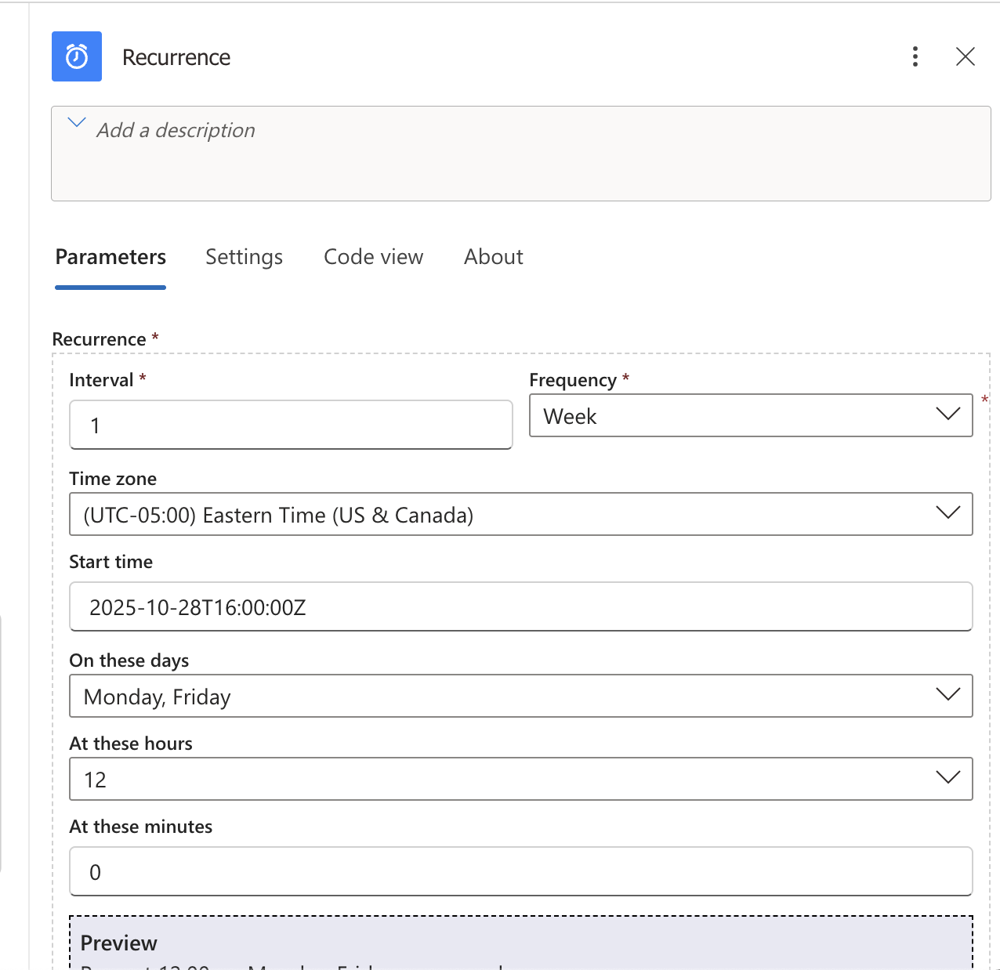
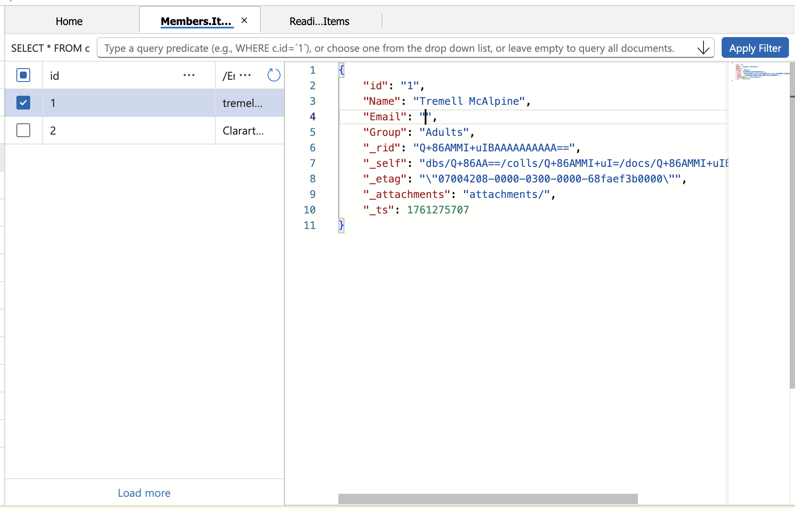
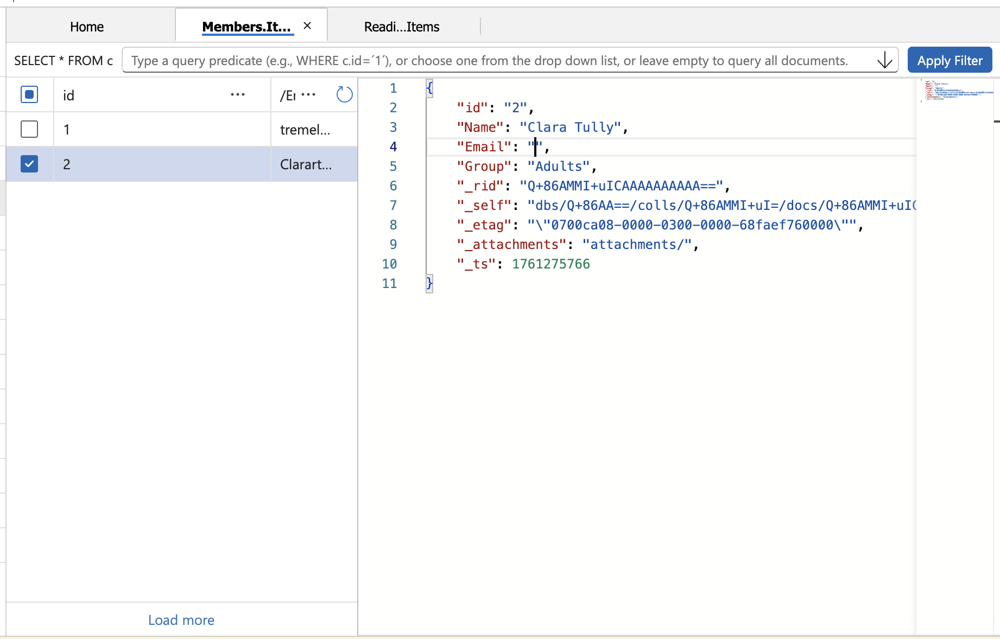
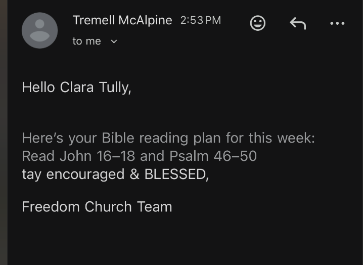
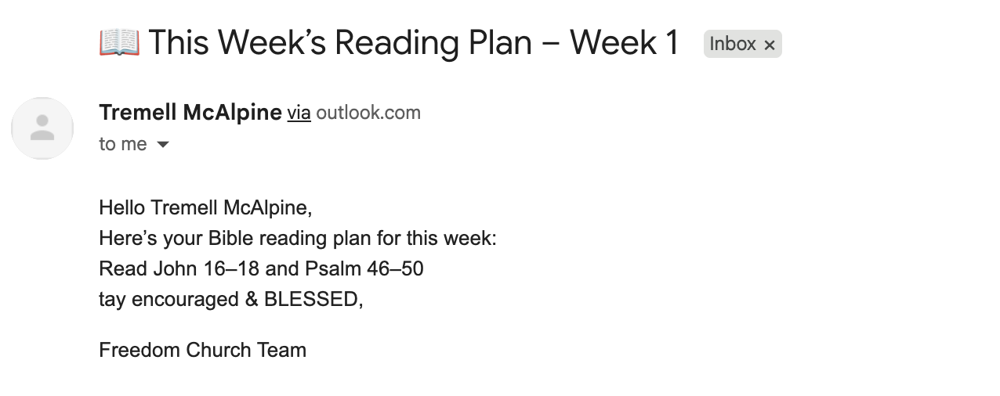

📧 Church Email Broadcaster – Project Summary

This project started when my pastor approached me looking for a better way to share our church’s weekly Bible reading plan with members.
Instead of posting the updates manually on social media, I decided to build an automated cloud-based email system using Microsoft Azure that could handle everything on its own.

---------------------------------------------------------------------------------------------------------------------------------------------

Azure Logic App – Email Automation Workflow

I created an Azure Logic App that serves as the brain of the system.
It uses a Recurrence trigger to automatically start the workflow every Monday and Friday at noon, sending out reading plan updates right on schedule.

---------------------------------------------------------------------------------------------------------------------------------------------

Azure Cosmos DB – Dynamic Data Source

I built a Cosmos DB database named ChurchData with two containers:

ReadingPlans – stores the current week’s plan (week number, start/end dates, and reading text)

Members – stores member details (name, email, and group tags like Dream Team or Church Members)

---------------------------------------------------------------------------------------------------------------------------------------------

The Logic App queries these containers each run — dynamically pulling the latest plan and matching it with each member’s information.

Personalized Email Delivery

Using the Outlook connector, the Logic App loops through all members in the database and sends each one a personalized email.
The message includes:

The current week’s reading plan (pulled from Cosmos DB)

A personalized greeting using the member’s name

The church’s signature at the end

Member Group Targeting 

---------------------------------------------------------------------------------------------------------------------------------------------

I designed the system to support Member Group Targeting, allowing the pastor to send messages to:

The entire church, or

A specific team like the Dream Team (Setup Team)

This makes it easy to manage both general updates and focused team communications within the same workflow.
